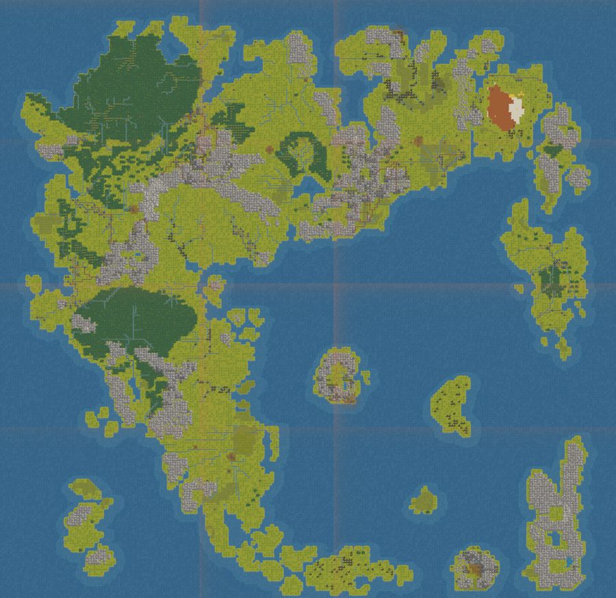

# Britannia world_gen for Dwarf Fortress

Built with **[Hand of Armok](https://github.com/Hearnoevil343/Handofarmok)**, my world builder for Dwarf Fortress: paint or import a map, run geological ages over it, and export a `world_gen.txt` that generates what you designed.

*The embark map straight out of Dwarf Fortress, stitched from screenshots. No editing. Click for the full size.*

**To use:** click **Raw** on `world_gen.txt`, save it as `world_gen.txt` in your DF `prefs` folder (Steam: `%APPDATA%\Bay 12 Games\Dwarf Fortress\prefs`), then *Create new world > Detailed mode* and pick **BRITANNIA** (257x257).

**What you get:** the Ultima VI surface map as DF terrain. The Serpent's Spine runs across the middle, the Deep Forest fills the north-west, the desert sits in the north-east, and the Isle of the Avatar is the only volcano in the world (checked in a generated world with DFHack).

**Needs the normal races.** Keep the vanilla entities (dwarves, elves, humans, goblins, kobolds) turned on. A mod set that replaces them can leave civs with nowhere to settle, and DF will keep rejecting the world.

Tested: world generated to year 250 without errors.

## Credit

Map data is derived from the Ultima VI surface map: Otmar Lendl's tile-id map (https://lendl.priv.at/~lendl/ultima/ultima6/brit.raw.gif) and Andrew Jenner's Ultima VI tile sheet (http://www.reenigne.org/computer/u6maps/u6tiles.png), with place coordinates from the Ultima Codex. Neither source states a licence, so this preset is shared for non-commercial use only.

Ultima, Britannia and their places are copyright Origin Systems / Electronic Arts.
